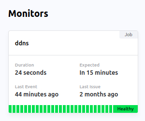

# DDNS

  

A dynamic DNS CronJob on Kubernetes that runs Terraform against AWS Route53 to ensure the A-record is kept up-to-date with my residential IP. This service is only intended to run on home development clusters.

See also the [status page](https://premiscale-development.cronitorstatus.com/).